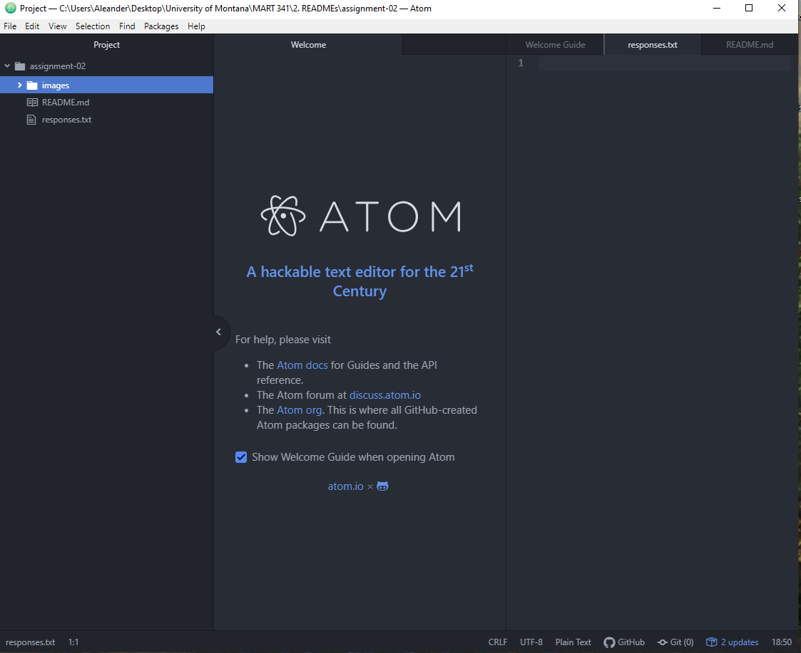

# Assignment-02
## Alexander C. Kaliczak

Q1. Why did you decide to take this class?

A1. I took this class because while I do want to go into programming, web
design seems like an inter-related, and useful skill to have.

- Q2. What are three things you've learned or hope to learn?
- A2. a. I've learned how to create a repository on Github
- b. how to use the file editor Atom.
- c. I still have a long way to go in both of those things, but I'm glad
to know already.
- d. For a third thing, something I'd like to know is how to develop
my own website front and back end.

Q3. What is a website you use frequently?
A3. [Project Noah](https://www.projectnoah.org)

### Responce file

[Responce file](./responses.txt)

### Screenshot

